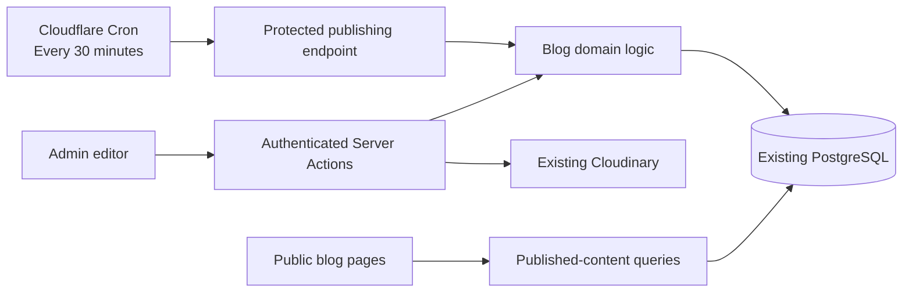

# SmartTools Blog — Database Design and LLD

This document defines the phase-one design. The backend is implemented in the modules listed below; frontend delivery is a separate task. Database migration and deployment have not been performed by this change.

### Backend implementation and verification

- `packages/database/drizzle/0006_blogs.sql`: additive, rerunnable schema and system-admin permissions; registered in the existing migration runner.
- `lib/blog/mutations.ts`: transactional draft/history, taxonomy, publication, schedule/retry, and lifecycle operations.
- `lib/blog/queries.ts`: permission-checked admin reads, public published-only reads, search, taxonomy, and pagination.
- `lib/blog/document.ts` and `lib/blog/images.ts`: bounded document validation, escaped rendering, and immutable Cloudinary image uploads.
- `lib/blog/publication.ts`: canonical metadata, script-safe structured data, and RSS generation.
- `app/admin/(protected)/blog/actions.ts`: session-derived mutation/read/upload actions with structured failures. Mutations accept `postId` and the expected `version`; none accepts an actor or editable slug.
- `app/blog/feed.xml/route.ts`, `app/sitemap.ts`, and `app/api/internal/blog/publish-due/route.ts`: public distribution and authenticated scheduling adapters.
- `worker.ts` and `wrangler.jsonc`: Cloudflare self-binding dispatch and the 30-minute trigger. Docker targeting uses the optional HTTPS `BLOG_PUBLISH_URL`.

Server mutation actions are `create`, `duplicate`, `save`, `publish`, `schedule`, `retrySchedule`, `cancelSchedule`, `unpublish`, `trash`, `restoreTrash`, `restoreRevision`, and `saveTerm`. Read actions are `list`, `post`, `history`, `preview`, and `taxonomy`. Save uses `mode: "autosave" | "manual"`; schedule uses an ISO timestamp with an explicit UTC offset. `saveTerm` accepts only `kind`, optional existing `id`, and `name`. A successful scheduling result includes the new schedule ID and frozen revision.

Retry publishes the existing due snapshot. Both the acting admin and original scheduling admin must still have publishing permission; rescheduling with a valid admin is required after the original publisher loses access.

Run backend checks without application credentials:

```sh
pnpm --pm-on-fail=ignore exec node --test tests/blog-*.test.mjs
pnpm --pm-on-fail=ignore lint
```

The database suites require an explicitly supplied **disposable** PostgreSQL URL; they create and remove their own random schemas and never load application environment files:

```sh
BLOG_TEST_DATABASE_URL='postgres://localhost/smarttools_blog_test' pnpm --pm-on-fail=ignore exec node --test tests/blog-*.integration.test.mjs
```

The fallback flag uses the available pnpm installation when the pinned package-manager download is unavailable. Production migration, secrets, and cron deployment remain operator steps. This implementation session could not execute PostgreSQL integration tests because the sandbox denied PostgreSQL shared-memory and socket access; mocked database-boundary tests do not establish real locking or migration behavior.

## 1. Confirmed requirements

- Admins create and manage articles; customers read them without signing in.
- Use the existing Next.js, PostgreSQL/Drizzle, Better Auth, authorization, audit, UI, and Cloudinary stack.
- Provide a visual editor, autosave, authenticated preview, revision history, publishing, scheduling, unpublishing, trash, and restoration.
- Include categories, tags, search, SEO metadata, RSS, and related SmartTools links.
- Manage one category/tag catalog shared across all blog posts, with admin creator/editor tracking. “Global” means blog-wide; other SmartTools features keep their existing taxonomy.
- Generate each post's slug **once from its initial title**. Add a random suffix on collision. **The slug never changes afterward**, including when restoring revisions.
- Use **Cloudflare Cron** to trigger scheduled publishing every **30 minutes**.
- Keep the publishing logic compatible with Cloudflare Workers and Docker; Cloudflare Cron is the selected scheduler for this phase.
- Start with indexed database reads and server-rendered pages. Persistent page caching remains deferred.

The existing tool code already provides title normalization and immutable stored slugs. Its current creation path rejects duplicate slugs; blogs will add the requested collision handling. See [slug normalization](../../packages/tool-catalog/src/index.ts) and [tool creation](../../lib/admin/adminMutations.ts).

The feature references are [HubSpot's publishing workflow](https://knowledge.hubspot.com/blog/create-and-publish-blog-posts), [WordPress's revision recovery](https://wordpress.org/documentation/article/revisions/), and [Ghost's automatic SEO](https://ghost.org/help/seo/).

## 2. Architecture



### Responsibilities

| Layer | Responsibility |
|---|---|
| Admin UI | Editing, save feedback, preview, history, publishing controls, taxonomy management. |
| Server Actions | Validate input, derive the actor from the session, call domain operations, return actionable results. |
| Blog domain | Revision creation, permissions, transactions, publishing, scheduling, conflict detection, auditing. |
| Public queries | Fetch only live content; implement listing, search, filters, article lookup, sitemap and RSS data. |
| Renderer | Render validated editor documents consistently for preview and public articles. |
| Scheduler endpoint | Authenticate the scheduler and invoke the same domain publishing operation. |
| Database | Enforce uniqueness, relationships, transaction isolation, and indexed retrieval. |

Application-owned blog logic belongs in `lib/blog`. Routes remain thin. Database declarations and migrations stay in the existing database package.

No separate CMS service, search service, message broker, or author-management subsystem is introduced.

### Phase-one user experience

| Area | Functionality |
|---|---|
| Admin dashboard | Search, status/category filters, pagination, create, duplicate into a draft, trash, and restore. |
| Visual editor | Headings, formatting, links, lists, quotes, images with alt text/captions, tables, code blocks, undo/redo. Use Tiptap with existing design-system controls. |
| Article details | Title, read-only URL, excerpt, cover image, editable public byline, one category, optional tags, and related SmartTools links. |
| Publishing | Autosave, manual save, authenticated preview, publish now, schedule, publish changes, cancel/reschedule, and unpublish. |
| History | Paginated revision list, snapshot preview, and restore-to-draft. |
| Public experience | Search, category/tag filters, pagination, responsive articles, reading time, heading navigation, copy-link sharing, and related tools. |
| SEO/distribution | Editable SEO title/description with defaults, canonical URLs, social metadata, BlogPosting structured data, sitemap inclusion, and RSS. |

Keep writing central, with publishing and article settings alongside it. Reuse the existing admin shell, public header/footer, controls, typography, feedback, and dialogs. No slug editing or redirects are included.

## 3. Revision storage model

**Revisions are complete article snapshots stored as JSONB rows in PostgreSQL.**

Drafts, revisions, live publication, and scheduling have separate storage:

| Concept | Storage | Mutable? |
|---|---|---|
| Current working draft | `blog_posts.draft_document` | Yes, through validated saves. |
| Historical revision | `blog_revisions.document` | No. |
| Live article | `blog_posts.published_revision_id` | The pointer changes; the referenced snapshot does not. |
| Scheduled article | `blog_post_schedules.revision_id` | Replacing the schedule creates a new request; the referenced snapshot does not change. |

For example:

| Moment | Working draft | Live revision | Scheduled revision |
|---|---|---|---|
| Create article | Initial content | None | None |
| Publish | Initial content | Revision 1 | None |
| Start editing | Updated content | Revision 1 | None |
| Schedule the update | Updated content | Revision 1 | Revision 2 |
| Continue editing | Further changes | Revision 1 | Revision 2 |
| Scheduler publishes | Further changes | Revision 2 | None |

The scheduler publishes **Revision 2**, even if the working draft has subsequently changed.

### Why complete snapshots

Each revision can be loaded, previewed, and restored independently. Restoration does not require replaying earlier edits, and deleting or corrupting one revision cannot invalidate a chain of later revisions.

JSONB accommodates the editor's structured document while keeping operational fields relational and indexed. Its structure still requires application validation; JSONB validity alone is insufficient. [PostgreSQL JSON documentation](https://www.postgresql.org/docs/current/datatype-json.html).

### Article document contract

The draft and every revision use the same versioned document shape:

| Field | Contents |
|---|---|
| `schemaVersion` | Version of the application's document format; initially `1`. |
| `title` | Article title. |
| `excerpt` | Short listing and metadata summary. |
| `body` | Allowlisted Tiptap document JSON. |
| `coverImage` | Optional Cloudinary reference, version, format, dimensions, alt text and caption. |
| `authorName` | Explicit public byline, initially “SmartTools Team.” |
| `category` | Selected category ID and a label snapshot for history display. |
| `tags` | Selected tag IDs and label snapshots. |
| `seoTitle` | Optional override; otherwise use the article title. |
| `seoDescription` | Optional override; otherwise use the excerpt. |
| `relatedToolIds` | Selected existing tool identifiers. |

Inline image nodes carry equivalent image references and accessibility text.

**The document does not contain the post ID, slug, publication dates, schedule, permissions, or trash state.** Restoring content must not rewind operational state.

Public taxonomy navigation resolves current category/tag names. Historical previews retain the labels captured in the revision.

## 4. Database changes

Add **six tables**. IDs use application-generated UUID strings stored as `text`, matching the existing repository convention. New timestamps use `timestamptz`.

### 4.1 `blog_posts`

One row per article, containing its permanent identity, working draft, and live publication pointer. Scheduling is owned entirely by `blog_post_schedules`; do not duplicate schedule fields or a schedule pointer on the post.

| Column | Type / nullability | Purpose |
|---|---|---|
| `id` | `text`, primary key | Permanent post identity. |
| `slug` | `text`, required, unique | Generated once; immutable. |
| `draft_document` | `jsonb`, required | Latest successfully saved draft. |
| `draft_hash` | `text`, required | Hash of normalized draft content for change detection. |
| `version` | `integer`, required, default `1` | Optimistic concurrency token. |
| `revision_sequence` | `integer`, required, default `0` | Allocates increasing revision numbers while the post is locked. |
| `draft_updated_at` | `timestamptz`, required | Last actual draft change. |
| `draft_updated_by` | `text`, nullable | Account responsible for that change. |
| `last_checkpoint_at` | `timestamptz`, nullable | Last historical snapshot creation time. |
| `published_revision_id` | `text`, nullable | Revision currently visible publicly. |
| `first_published_at` | `timestamptz`, nullable | First successful publication; preserved afterward. |
| `published_updated_at` | `timestamptz`, nullable | Last promotion that changed public content. |
| `published_category_id` | `text`, nullable | Indexed category projection of the live revision. |
| `published_search` | `tsvector`, nullable | Search projection of live title, excerpt and body text. |
| `created_by` | `text`, nullable | Creating admin. |
| `created_at` | `timestamptz`, required | Creation time. |
| `updated_at` | `timestamptz`, required | Last editorial or lifecycle change. |
| `trashed_at` | `timestamptz`, nullable | Soft deletion marker. |

The category and search fields are deliberately small projections of the live revision. Do not duplicate the full published article on this row.

**Constraints**

- Slug uniqueness applies to all posts, including trash. Old URLs cannot be reassigned.
- Reject slug updates at both the application boundary and database level.
- The published revision pointer must reference a revision belonging to the same post.
- A trashed post cannot retain a published pointer. The trash transaction also removes its schedule; scheduling operations reject trashed posts while holding the post lock.
- A published post must have a public category and publication timestamps.
- Account references use `ON DELETE SET NULL`; deleting an account must not delete articles or revisions.

**Indexes**

| Index | Purpose |
|---|---|
| Unique `slug` | Direct article lookup and collision enforcement. |
| `(first_published_at DESC, id DESC)`, live posts only | Stable newest-first public listing. |
| `(published_category_id, first_published_at DESC, id DESC)`, live posts only | Category filtering. |
| GIN on `published_search`, live posts only | Public full-text search. |
| `(updated_at DESC, id DESC)`, non-trashed posts | Admin listing. |
| `(trashed_at DESC, id DESC)`, trashed posts only | Trash listing. |

“Live posts only” means a non-null published pointer and no trash marker.

### 4.2 `blog_revisions`

One immutable row for each retained snapshot.

| Column | Type / nullability | Purpose |
|---|---|---|
| `id` | `text`, primary key | Revision identity. |
| `post_id` | `text`, required | Owning article. |
| `revision_number` | `integer`, required | Human-readable sequence within the article. |
| `document` | `jsonb`, required | Complete article snapshot. |
| `content_hash` | `text`, required | Hash of the normalized snapshot. |
| `reason` | `text`, required | `create`, `autosave`, `manual_save`, `publish`, `schedule`, `restore_backup`, or `restore`. |
| `source_revision_id` | `text`, nullable | Original revision used by a restore. |
| `created_by` | `text`, nullable | Admin responsible for creating the snapshot. |
| `created_at` | `timestamptz`, required | Snapshot creation time. |

**Constraints and indexes**

- Foreign key to `blog_posts`.
- Unique `(post_id, revision_number)`.
- Unique `(post_id, id)` to support same-post composite foreign keys.
- Restore-source references must also belong to the same post.
- JSON must be an object; document-schema validation occurs server-side.
- History reads use the revision-number index in descending order.
- Revision content is append-only. No application action updates existing snapshots.

Do not make `(post_id, content_hash)` unique. Returning to earlier content is a meaningful new historical event.

### 4.3 `blog_categories`

Categories are global catalog entries shared by all blog posts. This table has no `post_id`. An admin creates a category once, and any number of posts can select its ID. Creator/editor attribution records who managed the term without restricting it to that admin's posts.

| Column | Type | Purpose |
|---|---|---|
| `id` | `text`, primary key | Stable identity. |
| `name` | `text`, required | Public display name. |
| `slug` | `text`, required, unique | Stable filter identifier. |
| `created_by` | `text`, nullable | Creating admin account; assigned on creation and preserved on subsequent edits. |
| `updated_by` | `text`, nullable | Admin account responsible for the latest change. |
| `created_at` | `timestamptz`, required | Creation time. |
| `updated_at` | `timestamptz`, required | Last rename. |

Use case-insensitive name uniqueness.

Both actor columns reference `auth_users.id` with `ON DELETE SET NULL`. Creation requires an authenticated admin and assigns both columns from the server session. Nullable columns allow later account deletion without deleting a category or breaking article/history references.

One category is required for publishing; incomplete drafts may omit it.

Admins with `blog.edit` permission create and rename categories under **Admin → Blog → Categories & Tags** (`/admin/blog/taxonomy`). The article editor selects from this managed list. If it is empty, show a link to create a category and keep publishing disabled until one is selected.

### 4.4 `blog_tags`

Same structural columns as categories, including `created_by`, `updated_by`, and their nullable account foreign keys, with case-insensitive name uniqueness.

Tags are also global catalog entries shared by all blog posts, with no `post_id`. Selecting the same tag on several articles reuses one `blog_tags` row. Creator/editor attribution follows the same rules as categories.

Articles can have multiple tags. IDs remain stable when display names change.

Admins with `blog.edit` permission create and rename tags on the same taxonomy page. The article editor selects optional tags from that list; it does not silently create new tags from free text. Articles may be published without tags.

For phase one, taxonomy management supports creation and renaming. It does not hard-delete categories or tags, protecting references stored in drafts, schedules, and history.

### Category and tag attribution

- On creation, set `created_by` and `updated_by` to the authenticated admin, and set both timestamps.
- On an actual rename, preserve `created_by` and `created_at`; update `updated_by` and `updated_at`. An unchanged save does not change attribution.
- Derive actor IDs on the server; reject attempts to supply or overwrite them through taxonomy input.
- Commit the term mutation and its audit event in one transaction. Use `blog.category.create`, `blog.category.edit`, `blog.tag.create`, and `blog.tag.edit`, with the term ID as the target.
- Show creator and last-editor attribution in admin taxonomy management. Public taxonomy responses omit actor IDs; the article's public byline remains a separate field.
- Account deletion clears the affected actor references while preserving taxonomy entries and existing audit events.

### 4.5 `blog_published_post_tags`

This table records which global tags are selected for each published article. It does not define or duplicate tags. Draft/revision documents likewise store selected global IDs plus label snapshots for historical display; their selections do not make the taxonomy entries post-owned.

| Column | Type | Purpose |
|---|---|---|
| `post_id` | `text`, required | Published article. |
| `tag_id` | `text`, required | Selected public tag. |

- Composite primary key `(post_id, tag_id)`.
- Foreign keys to posts and tags.
- Reverse index `(tag_id, post_id)` for public filtering.
- Contains **only current live tag assignments**.
- Replaced transactionally when publishing; removed when unpublishing or trashing.
- Draft and historical selections remain inside their article documents.

### 4.6 `blog_post_schedules` (`PostSchedule`)

One row represents one active request to publish a specific revision. A post has zero or one active schedule.

| Column | Type / nullability | Purpose |
|---|---|---|
| `id` | `text`, primary key | Scheduling request identity; replaced on reschedule or scheduled-content replacement. |
| `post_id` | `text`, required, unique | Article being published. |
| `revision_id` | `text`, required | Frozen revision to publish. |
| `scheduled_at` | `timestamptz`, required | Earliest permitted publication time. |
| `scheduled_by` | `text`, nullable | Admin who authorized publication. Required when creating the schedule; nullable after account deletion. |
| `created_at` | `timestamptz`, required | When this request was created. |
| `last_attempt_at` | `timestamptz`, nullable | Last execution attempt. |
| `last_error_code` | `text`, nullable | Safe, structured reason for the latest failure. |

**Constraints and indexes**

- Foreign key `post_id` to `blog_posts.id`.
- Composite foreign key `(post_id, revision_id)` to `blog_revisions(post_id, id)` guarantees that the revision belongs to the scheduled post.
- Unique `post_id` enforces one active schedule per post, including concurrent requests.
- Foreign key `scheduled_by` to the account uses `ON DELETE SET NULL`; a missing scheduling account blocks execution with a visible error.
- Index `(scheduled_at, id)` supports due-work lookup directly on the schedules table.
- Creating or replacing a schedule locks the owning post and rejects trashed posts.

**Lifecycle**

- Scheduling creates a row. Rescheduling or replacing its content removes the old row and inserts a new request with a new ID in one transaction.
- Successful publication removes the row in the same transaction that updates the live revision, public projections, and audit history.
- Cancellation removes the row. Publish-now, unpublish, and trash also remove any active schedule within their own transaction.
- Failed attempts retain the row for retry and update only its attempt/error fields.
- Completed and cancelled requests are recorded in existing audit events with their schedule ID, revision ID, and requested publication time. They do not remain in this table.

No schedule status column is needed: row presence means active work, and `last_error_code` describes a failed attempt. Revision content remains retained after its schedule is removed.

This table gives scheduling clear ownership, keeps nullable scheduling fields off ordinary posts, and lets failure diagnostics update without rewriting the post. Both designs can scale with appropriate indexes; the split is justified by the scheduling lifecycle already required in this phase.

### Existing database changes

- Extend the permission catalog and stored system-admin permissions with blog actions.
- Reuse `audit_events`; no separate blog audit table.
- Register an additive blog migration in the existing migration runner.
- No changes to existing tool, template, or authentication data models.

No additional tables are needed for redirects, slug history, authors, HTML blocks, media libraries, or schedule history in this phase. `blog_post_schedules` is the only scheduling-work table; existing audit events hold its history.

## 5. Slug generation

Slug generation occurs during post creation, which requires a nonempty title.

1. Apply the existing tool-style normalization: lowercase, convert `&` to `and`, replace separators with hyphens, and trim them.
2. Bound the slug length to 160 characters.
3. Attempt to insert the post using the base slug.
4. On a slug uniqueness conflict, append an eight-character cryptographically generated hexadecimal suffix, shortening the base as needed to keep the total within 160 characters.
5. Retry with a new suffix if necessary, up to five attempts.
6. If the normalized title contains no usable ASCII characters, use `post-<random-suffix>`.

Examples:

| Initial title | Generated slug |
|---|---|
| How to Compress PDF Files | `how-to-compress-pdf-files` |
| Same title already exists | `how-to-compress-pdf-files-a7c91e42` |
| Later title changes | Existing slug remains unchanged. |

The database unique constraint decides availability. Do not fetch all existing slugs or rely on a preflight check alone.

The UI displays the final URL as read-only. There is no slug-edit or regeneration action.

## 6. Autosave, checkpoints, and restoration

### Autosave

- Save after three seconds without typing.
- During continuous typing, attempt a save at least every 30 seconds.
- Permit one in-flight save per editor; retain newer local changes for the next save.
- Each request includes the post ID and expected `version`.
- Show explicit saving, saved, failed, and conflict states.

Within a transaction:

1. Check permission and lock the post.
2. Compare the expected version.
3. Validate and normalize the document.
4. If content is unchanged, return without rewriting it.
5. Save the draft and increment the version.
6. Create a checkpoint if at least 60 seconds have passed since the previous snapshot and the content differs from the latest revision.

Checkpoint creation is driven by successful saves. It does not require another background scheduler.

A final edit saved before the next checkpoint remains safely stored as the current draft, even if it has not yet become a historical revision.

### Explicit snapshots

Manual save, publish, and schedule ensure the current persisted draft has a revision immediately.

Reuse the latest revision when its document is identical. Avoid creating duplicate snapshots merely because the same button was clicked twice.

Publication and scheduling events remain recorded in the audit log even when they reference an existing snapshot.

### Restore revision

Restoring Revision 4 does not edit Revision 4.

1. Lock the post and verify the expected version.
2. Read and validate the selected same-post revision.
3. Preserve the current draft as a `restore_backup` snapshot if it is not already checkpointed.
4. Copy the selected document into the working draft.
5. Append a new `restore` revision referencing Revision 4.
6. Increment the post version and write an audit event.

The slug, live revision, schedule, publication dates, and trash state remain unchanged.

### Retention

- Retain all historical checkpoints and trashed posts in phase one.
- Do not automatically delete Cloudinary assets referenced by revisions.
- History lists fetch revision summaries with pagination; load the full document only when previewing or restoring it.
- Monitor storage growth before introducing retention or archival.

## 7. Publishing lifecycle

There is no single stored status enum because an article can be live while also having draft changes and a scheduled update.

| Display state | Derived condition |
|---|---|
| Draft | No live revision, no schedule row, not trashed. |
| Scheduled | No live revision, with a schedule row. |
| Published | Live revision exists. |
| Published · unpublished changes | Working-draft hash differs from live revision hash. |
| Published · update scheduled | Live revision and a schedule row both exist. |
| Trash | `trashed_at` exists. |
| Publishing delayed/failed | Schedule is overdue or has an execution error. |

Admin lists join `blog_post_schedules` by `post_id` to derive scheduling state. Public reads do not join schedules.

### Publish now

Flush pending editor saves first. The publish operation then uses the acknowledged version and persisted draft.

One transaction:

- Check publishing permission.
- Validate required publishing fields.
- Ensure an immutable snapshot exists.
- Set the live revision pointer.
- Replace public category, search, and tag projections.
- Set publication timestamps.
- Remove any active schedule row and audit its cancellation.
- Increment the version and write the audit event.

A reader sees either the previous committed article or the newly committed article. It must never see a mixture of versions.

### Unpublish

Clear the live pointer and public projections, remove any active schedule row, and audit the operation in one transaction. Retain draft content and history.

Public article requests return 404. The post disappears from public listings, search, RSS, and sitemap.

### Trash and restore

Trashing unpublishes the article, removes any active schedule row, and sets `trashed_at` in one transaction.

Restoring trash clears the marker and returns the article to draft. It does not automatically republish or recreate a schedule.

### Duplicate

Create a new draft from the selected post's working document. Generate a new immutable slug, adding a collision suffix as needed. Do not copy publication state, schedule, or historical revisions.

## 8. Scheduling every 30 minutes

Cloudflare Cron is the scheduler for this phase. Use `*/30 * * * *`, running at `:00` and `:30`. Cloudflare Cron evaluates schedules in UTC; article scheduling timestamps are also stored in UTC. [Cloudflare Cron documentation](https://developers.cloudflare.com/workers/configuration/cron-triggers/).

An article scheduled for 10:12 becomes eligible at 10:12 and normally publishes during the 10:30 run. Outages or backlog can delay it further.

The admin UI must state this timing behavior and display the editor's timezone explicitly.

### Scheduling operation

- Save pending edits.
- Check publishing permission, lock the post, and verify the expected post version.
- Validate publication requirements.
- Create or reuse an immutable revision.
- Insert `blog_post_schedules` with a new request ID, post ID, revision ID, requested time, and authorizing admin.
- When rescheduling or replacing scheduled content, remove the previous row and insert the replacement in the same transaction. New rows start without attempt/error information.
- Increment the post version and record an audit event in the same transaction.

Further draft edits do not alter this snapshot. Replacing the scheduled content requires an explicit “Update scheduled version” action.

Cancellation locks the post, checks publishing permission and the expected version, removes its schedule row, increments the post version, and writes the audit event in one transaction. User-facing schedule changes therefore participate in normal editor conflict detection even though scheduling data lives separately.

### Execution

The Cloudflare scheduled handler calls the application-owned endpoint:

**`POST /api/internal/blog/publish-due`**

- Register the 30-minute trigger on the existing Cloudflare Worker and add a scheduled handler.
- For the Workers deployment, invoke the endpoint through the existing Worker service binding so it retains the application's database request lifecycle.
- If the application is hosted on Docker, Cloudflare remains the scheduler and sends an authenticated HTTPS request to that deployment's production endpoint. A Docker-host cron is not required.
- Configure one production target per database. Every invocation uses `BLOG_SCHEDULER_SECRET` as a bearer secret and the same database-backed publishing implementation.
- Await the endpoint result and report non-success responses through Worker observability. The scheduler carries no article content or direct database credentials for a remote Docker target.

For each run:

1. Capture database time as the eligibility cutoff.
2. Read candidate rows from `blog_post_schedules` where `scheduled_at <= cutoff`, ordered by `(scheduled_at, id)`, in batches of 50.
3. Process candidates independently. Lock the owning post first, skipping it if another worker holds the lock, then lock and re-read its schedule row. Every operation touching both tables uses this same post-then-schedule lock order.
4. Recheck the candidate request ID, due time, and non-trashed post state. Skip candidates that were removed or replaced after the initial read.
5. Recheck that the scheduling admin still has active publishing permission.
6. Promote the frozen revision, update public projections and publication timestamps, remove the matching schedule row, increment the post version, and write the audit event in one transaction.
7. Preserve any newer working draft.

A post is attempted at most once per invocation. Continue through failures so one bad schedule cannot block others. Stop between posts after a 20-second processing budget and report remaining work for the next run.

PostgreSQL row locks provide coordination without an application-wide lock. [PostgreSQL locking documentation](https://www.postgresql.org/docs/current/explicit-locking.html).

### Failure handling

- Successful promotion removes the matching schedule row atomically, making duplicate invocations harmless.
- Failed schedules remain due and retry on subsequent runs.
- After a failed transaction rolls back, record the attempt/error in a separate transaction.
- Update diagnostics by the captured `blog_post_schedules.id` only. If that request was removed or replaced, the update affects no row; an old attempt must not overwrite a replacement schedule's state.
- Failure diagnostics change only `last_attempt_at` and `last_error_code` on the schedule. They do not rewrite the draft or increment the post version.
- Show retry-now and cancel controls to authorized admins.
- Missing/deleted/suspended publishers or revoked permissions block publication until an authorized admin reschedules it.
- Log post IDs, schedule IDs, counts, durations and safe error codes; never log article bodies or secrets.

## 9. Interfaces and authorization

### Routes

| Route | Purpose |
|---|---|
| `/blog` | Public listing, search and filters. |
| `/blog/[slug]` | Published article. |
| `/blog/feed.xml` | RSS feed. |
| `/admin/blog` | Post list, filters and trash. |
| `/admin/blog/new` | Create from an initial title. |
| `/admin/blog/[id]` | Editor, publishing settings and history. |
| `/admin/blog/[id]/preview` | Authenticated draft/revision preview. |
| `/admin/blog/taxonomy` | Category/tag creation and renaming. |
| `/api/internal/blog/publish-due` | Scheduler-only endpoint. |

### Server operations

| Operation | Main input | Result |
|---|---|---|
| Create | Initial title | Post ID, fixed slug, version. |
| Save | Post ID, expected version, document | Current version and save/checkpoint information. |
| Publish | Post ID, expected version | Live revision and publication state. |
| Schedule/replace | Post ID, expected version, requested timestamp | Schedule ID and frozen revision. |
| Cancel/unpublish/trash/restore trash | Post ID, expected version | Updated lifecycle state. |
| Restore revision | Post ID, expected version, revision ID | Updated draft and new revision. |
| Read history | Post ID, cursor | Revision summaries and next cursor. |
| Create/rename category or tag | Term type, name, and existing term ID for rename | Managed taxonomy entry with server-assigned creator/editor attribution. |

Actor identity always comes from the server session, never request input.

Use structured outcomes such as validation error, forbidden, version conflict, not found, and temporary failure.

### Permissions

- `blog.view`: admin reads, preview and history.
- `blog.create`: create and duplicate.
- `blog.edit`: draft editing, uploads, revision restoration and taxonomy management.
- `blog.publish`: publish, schedule, replace/cancel scheduling and unpublish.
- `blog.archive`: trash and restore trash.
- Trashing a live article additionally requires `blog.publish`.

Existing `admin.enter` and permission prerequisites continue to apply.

## 10. Public rendering, search, and safety

- Public queries read only the published revision and its matching projections.
- SQL listing queries project title, excerpt and image fields; they do not transfer every article body.
- Use keyset pagination: 12 public results and 25 admin/history results per page.
- Search uses PostgreSQL full-text search over live title, excerpt and extracted body text. Search queries are bounded and parameterized.
- The server renders article content using the same allowlisted renderer as preview. Public browsers do not load the editor.
- Derive reading time and heading navigation from the published document.
- Generate canonical URLs from `APP_URL` and the immutable slug.
- Draft saves do not change public metadata, publication dates, RSS, or sitemap entries.
- Preview responses are authenticated, `no-store`, and `noindex`.

Validate documents at save, restore, and publication boundaries. Bound serialized document size to 1 MiB and reject unsupported nodes, excessive nesting, unsafe URL schemes, and executable HTML.

Uploads support JPEG, PNG and WebP up to 5 MiB. Use immutable, versioned Cloudinary asset references. Replacing an image must not overwrite an asset used by a live article or revision.

Cloudinary delivery URLs remain public assets; authenticated previews protect the unpublished article page.

Add Blog to public navigation and the admin menu. Extend existing consent-based analytics without recording draft content or search queries. Search/filter combinations are excluded from indexing; canonical article pages remain indexable.

## 11. Migration and rollout

Add a rerunnable migration, registered after the existing migrations:

1. Create the six tables, with `blog_post_schedules` after posts, revisions, and account dependencies exist.
2. Add the published-revision pointer and same-post schedule/revision foreign keys after their referenced tables exist.
3. Add constraints and indexes.
4. Add database enforcement for immutable slugs.
5. Grant blog permissions to the stored system-admin role.
6. Preserve custom-role permissions.
7. Restore the system-role protection trigger before committing.

The current migration runner reapplies its migration list, so rerunning this migration must not duplicate grants, alter article content, or reset state.

Document `BLOG_SCHEDULER_SECRET` with an empty value in `.env.example`. Configure the same secret in the app and the Cloudflare scheduler. Register `*/30 * * * *` in the Worker's cron triggers and verify the configured production target.

Deploy database changes before application changes. Verify exactly one Cloudflare scheduling trigger targets each production database; duplicate scheduling remains safe but unnecessary. Vercel Cron and host-managed cron setup are outside this phase.

## 12. Verification and acceptance

### Database and concurrency

- Simultaneous creation with identical titles produces distinct slugs.
- Slug changes fail through save, restore and direct database updates.
- A post cannot point to another post's revision.
- A schedule cannot reference another post's revision, and concurrent requests cannot create two active schedules for one post.
- Stale saves preserve local edits and report a conflict.
- Publishing commits the revision pointer, search/category/tag projections, matching schedule removal, and audit event atomically.
- Account deletion preserves articles and history.
- Migration reruns preserve data and protection triggers.

### Revisions

- Autosave persists current work independently of checkpoint creation.
- Minute checkpoints and explicit saves avoid identical duplicate snapshots.
- Restoring a revision preserves the current draft first.
- Restoration never changes the slug, live article or schedule.
- Historical images remain available after edits, trash and restore.

### Scheduling

- Verify the Cloudflare trigger sends an authenticated request every 30 minutes to the intended production deployment; requests with a missing or incorrect secret are rejected.
- Selected times publish on the next eligible half-hour run.
- Missed runs catch up using `scheduled_at <= database time`.
- Newer draft edits cannot change a frozen scheduled revision.
- Concurrent workers publish a schedule only once.
- Cancellation/replacement races do not resurrect old schedules.
- Failed attempts cannot attach errors to a replacement schedule.
- One failed post does not block other due posts.
- Success and cancellation remove schedule rows while preserving revisions and audit history.
- Failure diagnostics leave draft content and the post version unchanged.
- Publish-now, unpublish, and trash remove active schedules atomically with the post transition.
- Scheduler and admin operations use the same post-then-schedule lock order under concurrent execution.

### Public and admin flows

- Drafts, unpublished posts and trash never appear publicly.
- Anonymous visitors cannot access previews or history.
- Search, taxonomy filters, pagination, SEO, RSS and sitemap use live content only.
- Only admins with `blog.edit` can create or rename categories and tags; editors select existing terms, with one category required for publishing and tags optional.
- Category/tag creation assigns both actor fields from the session; rename preserves the creator and updates the editor, while no-op saves preserve attribution.
- Forged taxonomy actor fields are rejected, term changes and audit events commit atomically, and deleting an admin clears actor references without deleting terms.
- Public taxonomy responses exclude creator/editor account IDs.
- Keyboard and mobile flows cover editing, saving, preview, history and recovery.
- Validate representative database query plans and latency with a large fixture.
- Run focused tests, PostgreSQL integration tests, `pnpm test`, `pnpm lint`, and relevant Playwright flows.
- Finish implementation verification with `git diff --check` and `git status --short`.

Phase one excludes comments, newsletters, approval chains, multilingual publishing, real-time collaboration, AI writing, permanent deletion, revision-diff UI, and persistent page caching.
